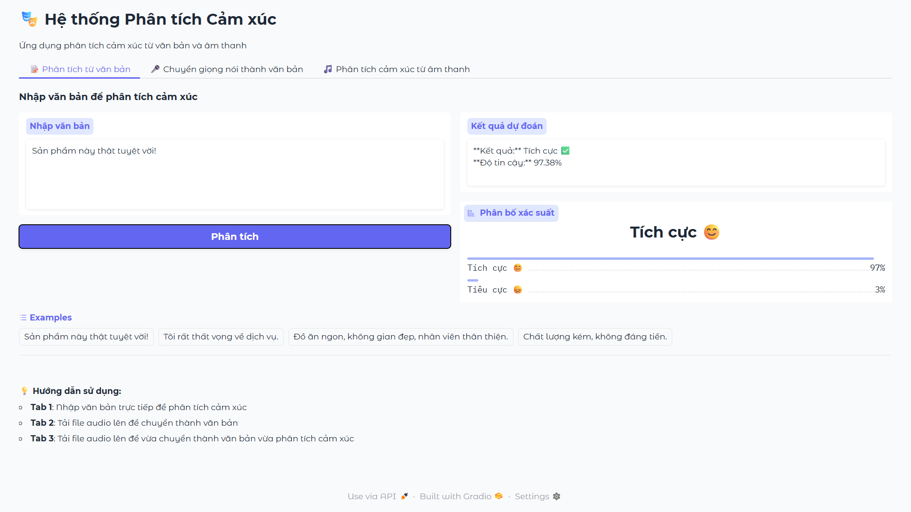

# 🎭 Vietnamese Sentiment Analysis System

A web application for Vietnamese sentiment analysis from text and audio using **PhoWhisper** and **PhoBERT**.

[](https://www.python.org/downloads/)
[](https://gradio.app/)
[](LICENSE)

## 🌟 Features

### 1. 📝 Text Sentiment Analysis
- Input Vietnamese text directly
- Sentiment classification (Positive/Negative)
- Confidence score (%)
- Probability distribution visualization

### 2. 🎙️ Quick Record & Analyze ⭐ NEW
- **Direct microphone recording**
- Real-time speech-to-text conversion
- Instant sentiment analysis
- Simple, user-friendly interface

### 3. 🎤 Speech-to-Text Conversion
- Record directly or upload audio files (mp3, wav, m4a, etc.)
- Vietnamese speech recognition with PhoWhisper
- Accurate text transcription

### 4. 🎵 Audio Sentiment Analysis
- Record directly or upload audio files
- Automatic text conversion
- Detailed sentiment analysis with probabilities

## 🚀 Demo




## 📋 Requirements

- Python 3.8+
- CUDA (recommended for GPU acceleration)
- RAM: Minimum 8GB (16GB recommended)

## 🔧 Installation

### 1. Clone the repository

```bash
git clone https://github.com/KPN147/Vietnamese-Sentiment-Analysis-System.git
cd vietnamese-sentiment-analysis
```

### 2. Install dependencies

```bash
pip install -r requirements.txt
```

### 3. Configure models

Edit `config.py` and update the model paths:

```python
# Line 7-8
SENTIMENT_MODEL_NAME = "KPN14/phobert_sentiment"  
SPEECH_MODEL_NAME = "vinai/PhoWhisper-large"  # Or medium/small
```

### 4. Project structure

```
project/
├── sentiment_app.py       # Main application
├── config.py             # Configuration file
├── requirements.txt      # Dependencies
├── README.md            # Documentation
└── models/
    └── phobert_sentiment/
        ├── config.json
        ├── pytorch_model.bin
        ├── tokenizer_config.json
        ├── vocab.txt
        └── ...
```

## 🎯 Usage

### Run the application

```bash
python sentiment_app.py
```

The app will be available at: `http://localhost:7860`

### Using the interface

#### Tab 1: Text Analysis
1. Enter Vietnamese text in the input box
2. Click "Analyze" button
3. View sentiment result and probability distribution

#### Tab 2: Quick Record & Analyze (Recommended)
1. Click the microphone icon 🎙️
2. Allow browser to access microphone (first time only)
3. Click **Record** (▶️) button
4. Speak your content in Vietnamese
5. Click **Stop** (⏹️) button
6. Click "🚀 Analyze Now" button
7. View results immediately!

#### Tab 3: Speech-to-Text
1. Record or upload audio file
2. Click "Convert" button
3. View transcribed text

#### Tab 4: Audio Sentiment Analysis
1. Record or upload audio file
2. Click "Analyze" button
3. View text transcription, sentiment, and probabilities

## ⚙️ Configuration

### Change PhoWhisper model size

In `config.py`, line 11:

```python
# Large (best accuracy, slower)
SPEECH_MODEL_NAME = "vinai/PhoWhisper-large"

# Medium (balanced)
SPEECH_MODEL_NAME = "vinai/PhoWhisper-medium"

# Small (faster, less accurate)
SPEECH_MODEL_NAME = "vinai/PhoWhisper-small"
```

### Adjust label mapping

If your PhoBERT model has different labels (e.g., 0=Positive, 1=Negative), edit `config.py`:

```python
# Line 15
LABEL_0_IS_NEGATIVE = False  # Change to False if 0=Positive
```

### Create public link (share via Internet)

In `config.py`, line 25:

```python
SHARE_PUBLICLY = True  # Change to True to create public link
```

## 🛠️ Technology Stack

- **Frontend**: [Gradio](https://gradio.app/) - Web UI framework
- **Speech Recognition**: [PhoWhisper](https://huggingface.co/vinai/PhoWhisper-large) - Vietnamese speech-to-text
- **Sentiment Analysis**: [PhoBERT](https://github.com/VinAIResearch/PhoBERT) - Vietnamese BERT model
- **Deep Learning**: PyTorch, Transformers

## 📊 Performance

| Model | VRAM | Processing Time (GPU) |
|-------|------|----------------------|
| PhoWhisper-small | ~2GB | ~2-3s for 30s audio |
| PhoWhisper-medium | ~5GB | ~3-5s for 30s audio |
| PhoWhisper-large | ~10GB | ~5-8s for 30s audio |
| PhoBERT | ~1GB | ~0.1s per sentence |

*Note: CPU processing will be slower but fully functional*

## 🐛 Troubleshooting

### Error: Out of Memory (OOM)
- Reduce `MAX_TEXT_LENGTH` in `config.py` (line 20)
- Use PhoWhisper-medium or small instead of large
- Close other GPU/RAM-intensive applications

### Error: CUDA not available
- Application automatically falls back to CPU
- Processing will be slower but functional
- Install CUDA toolkit if GPU is available

### Error: Microphone not working
- **Chrome/Edge**: Click 🔒 icon left of URL → Allow Microphone
- **Firefox**: Click 🔒 icon → Permissions → Microphone → Allow
- **Safari**: Safari → Settings → Websites → Microphone → Allow
- Ensure microphone is connected and working
- Try refreshing (F5) the page after granting permission
- Check microphone in OS settings

### Error: "NotAllowedError: Permission denied"
- Browser has blocked microphone access
- Clear site settings and try again
- For localhost: Access via `http://localhost` not IP address
- Try using HTTPS if available

## 🌐 Browser Compatibility

| Browser | Text Analysis | Audio Upload | Microphone Recording |
|---------|--------------|--------------|---------------------|
| Chrome 90+ | ✅ | ✅ | ✅ |
| Firefox 88+ | ✅ | ✅ | ✅ |
| Safari 14+ | ✅ | ✅ | ✅ |
| Edge 90+ | ✅ | ✅ | ✅ |

## 📝 Notes

- Supported audio formats: WAV, MP3, FLAC, M4A, OGG
- Maximum text length: 256 tokens (configurable)
- Models automatically use GPU if available
- First-time model loading may take a few minutes
- Microphone requires HTTPS or localhost for security

## 🤝 Contributing

Contributions are welcome! Please feel free to submit a Pull Request.

1. Fork the repository
2. Create your feature branch (`git checkout -b feature/AmazingFeature`)
3. Commit your changes (`git commit -m 'Add some AmazingFeature'`)
4. Push to the branch (`git push origin feature/AmazingFeature`)
5. Open a Pull Request

## 📄 License

This project is licensed under the MIT License - see the [LICENSE](LICENSE) file for details.

## 🙏 Acknowledgments

- [VinAI Research](https://www.vinai.io/) for PhoWhisper and PhoBERT models
- [Gradio](https://gradio.app/) for the amazing web UI framework
- [Hugging Face](https://huggingface.co/) for the Transformers library

## ⭐ Star History

If you find this project useful, please consider giving it a star!
---
Made with ❤️ for Vietnamese NLP community
