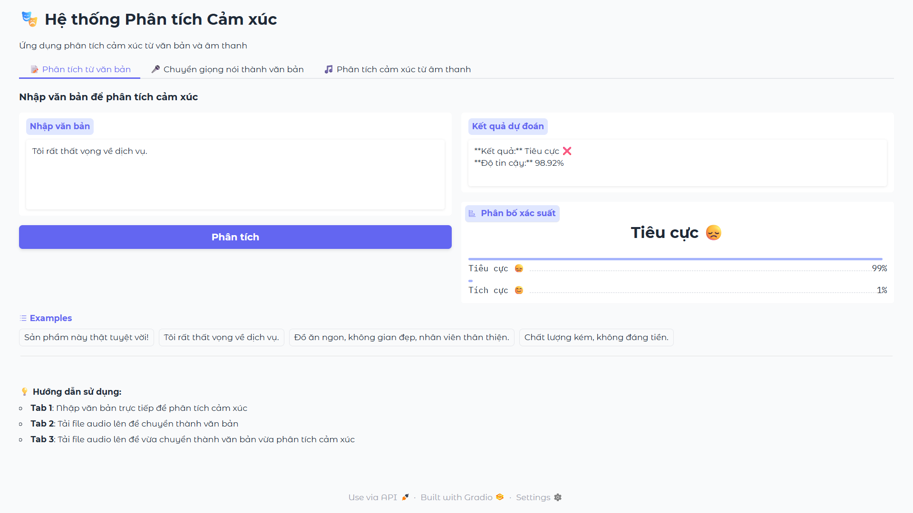

# 🎭 Vietnamese Sentiment Analysis System

A production-ready web application for Vietnamese sentiment analysis from **text** and **audio** using **PhoBERT** and **PhoWhisper**.

[](https://www.python.org/downloads/)
[](https://fastapi.tiangolo.com/)
[](https://gradio.app/)
[](LICENSE)

## 🌟 Features

| Feature | Description |
|---------|-------------|
| 📝 Text Sentiment | Classify Vietnamese text as Positive/Negative with confidence scores |
| 🎤 Speech-to-Text | Convert Vietnamese audio to text using PhoWhisper |
| 🎵 Audio Sentiment | End-to-end pipeline: Audio → Text → Sentiment |
| 🔌 REST API | FastAPI endpoints for programmatic access |
| 🐳 Docker | Containerized deployment |

## 🚀 Demo




## 📁 Project Structure

```
project/
├── app/
│   ├── main.py                 # FastAPI entry point + Gradio mount
│   ├── settings.py             # Pydantic BaseSettings (env-based config)
│   ├── schemas.py              # Request/Response Pydantic models
│   ├── services/
│   │   ├── sentiment_service.py  # PhoBERT inference logic
│   │   └── speech_service.py     # PhoWhisper STT logic
│   ├── models/
│   │   ├── loaders.py          # Model loading utilities
│   │   └── registry.py         # Singleton model registry
│   └── ui/
│       └── gradio_app.py       # Gradio web interface
├── evaluation/                 # Model evaluation scripts
├── tests/                      # Unit & integration tests
├── scripts/                    # Utility scripts
├── notebooks/                  # Jupyter notebooks
├── README.md
├── requirements.txt
├── pyproject.toml
├── Dockerfile
└── .env.example
```

## 📋 Requirements

- Python 3.9+
- CUDA (recommended for GPU acceleration)
- RAM: Minimum 8GB (16GB recommended)

## 🔧 Installation

### 1. Clone the repository

```bash
git clone https://github.com/KPN147/Vietnamese-Sentiment-Analysis-System.git
cd Vietnamese-Sentiment-Analysis-System
```

### 2. Create virtual environment (recommended)

```bash
python -m venv venv
source venv/bin/activate    # Linux/macOS
venv\Scripts\activate       # Windows
```

### 3. Install dependencies

```bash
pip install -r requirements.txt
```

### 4. Configure environment

```bash
cp .env.example .env
# Edit .env if you need to change model names or server settings
```

## 🎯 Usage

### Run the application

```bash
# Option 1: Python module
python -m app.main

# Option 2: Uvicorn directly
uvicorn app.main:app --host 0.0.0.0 --port 7860
```

The app will be available at: `http://localhost:7860`

### Docker

```bash
# Build
docker build -t sentiment-analysis .

# Run
docker run -p 7860:7860 sentiment-analysis
```

### REST API

```bash
# Health check
curl http://localhost:7860/health

# Predict sentiment
curl -X POST http://localhost:7860/api/v1/predict \
  -H "Content-Type: application/json" \
  -d '{"text": "Sản phẩm này thật tuyệt vời!"}'
```

**API Documentation**: `http://localhost:7860/docs` (Swagger UI)

### Run tests

```bash
pytest tests/ -v
```

## ⚙️ Configuration

All settings can be configured via environment variables or `.env` file:

| Variable | Default | Description |
|----------|---------|-------------|
| `SENTIMENT_MODEL_NAME` | `KPN14/phobert_sentiment` | HuggingFace sentiment model |
| `SPEECH_MODEL_NAME` | `vinai/PhoWhisper-large` | HuggingFace ASR model |
| `MAX_TEXT_LENGTH` | `256` | Maximum token length |
| `SERVER_PORT` | `7860` | Server port |
| `SERVER_NAME` | `0.0.0.0` | Server host |
| `SHARE_PUBLICLY` | `false` | Create Gradio public link |

## 🛠️ Technology Stack

- **Backend**: [FastAPI](https://fastapi.tiangolo.com/) — async REST API
- **Frontend**: [Gradio](https://gradio.app/) — ML web UI framework
- **Speech Recognition**: [PhoWhisper](https://huggingface.co/vinai/PhoWhisper-large) — Vietnamese ASR
- **Sentiment Analysis**: [PhoBERT](https://github.com/VinAIResearch/PhoBERT) — Vietnamese BERT
- **Deep Learning**: PyTorch, Transformers
- **Config**: Pydantic Settings with `.env` support
- **Testing**: pytest

## 📊 Performance

| Model | VRAM | Processing Time (GPU) |
|-------|------|----------------------|
| PhoWhisper-small | ~2GB | ~2-3s for 30s audio |
| PhoWhisper-medium | ~5GB | ~3-5s for 30s audio |
| PhoWhisper-large | ~10GB | ~5-8s for 30s audio |
| PhoBERT | ~1GB | ~0.1s per sentence |

## 🐛 Troubleshooting

| Issue | Solution |
|-------|----------|
| Out of Memory | Use PhoWhisper-small/medium, reduce `MAX_TEXT_LENGTH` |
| CUDA not available | Auto-fallback to CPU (slower but functional) |
| Microphone not working | Grant browser microphone permission, use localhost |

## 🤝 Contributing

1. Fork the repository
2. Create your feature branch (`git checkout -b feature/AmazingFeature`)
3. Commit your changes (`git commit -m 'Add some AmazingFeature'`)
4. Push to the branch (`git push origin feature/AmazingFeature`)
5. Open a Pull Request

## 📄 License

This project is licensed under the MIT License - see the [LICENSE](LICENSE) file for details.

## 🙏 Acknowledgments

- [VinAI Research](https://www.vinai.io/) for PhoWhisper and PhoBERT models
- [Gradio](https://gradio.app/) for the web UI framework
- [Hugging Face](https://huggingface.co/) for the Transformers library

---
Made with ❤️ for Vietnamese NLP community
